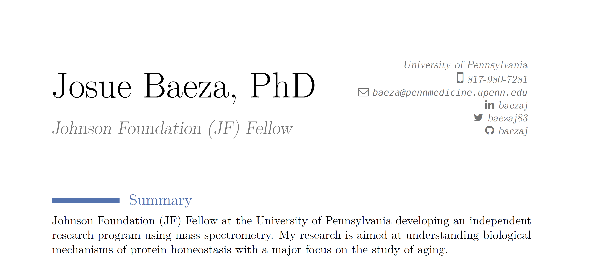

<!-- README.md is generated from README.Rmd. Please edit that file -->

```{r, include = FALSE}
knitr::opts_chunk$set(
  collapse = TRUE,
  comment = "#>"
) 
```


# Josue Baeza - Curriculum Vitae

My CV created with the [vitae](https://github.com/mitchelloharawild/vitae) package in R. 

[](https://github.com/baezaj/CV/blob/main/Baeza_cv.pdf)